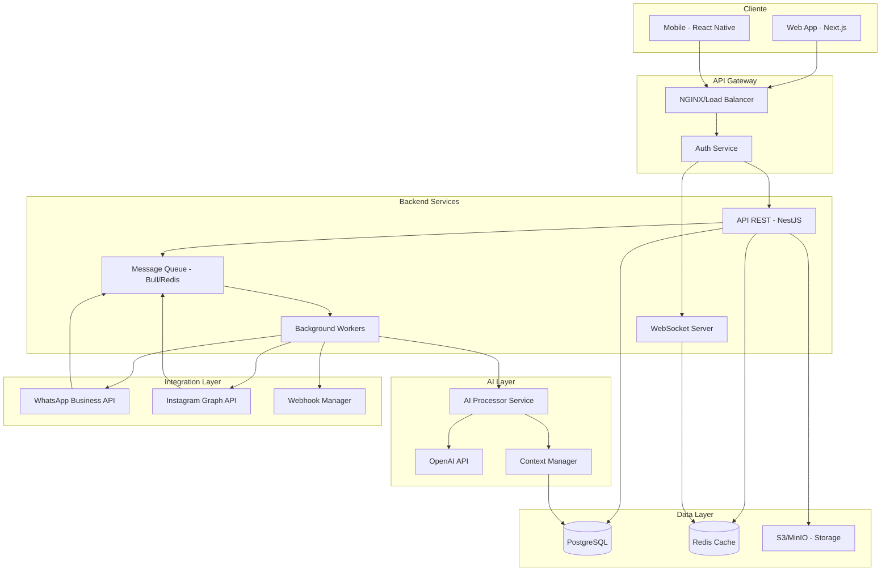
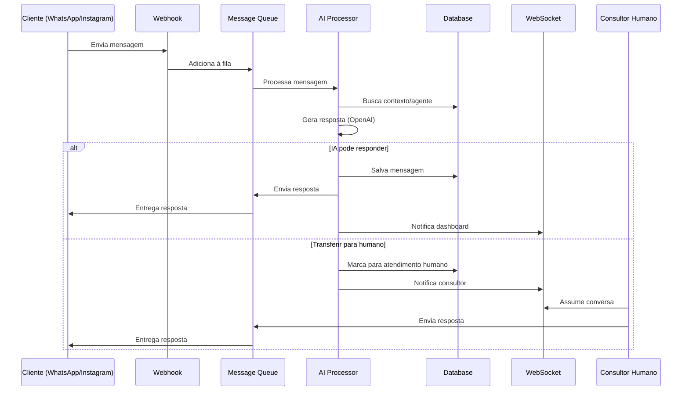
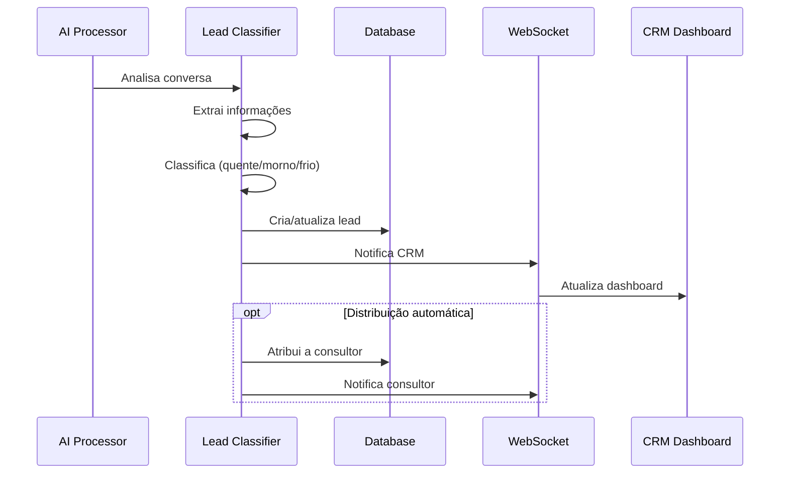
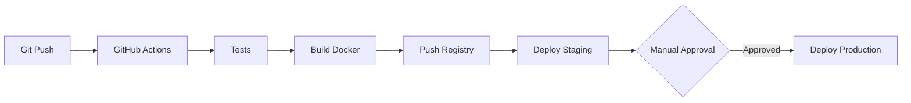

# SmarterChat - Arquitetura do Sistema

## 1. Visão Geral da Arquitetura

O SmarterChat é uma plataforma SaaS multi-tenant para criação e gerenciamento de agentes de IA corporativos com atendimento híbrido (IA + Humano).

### 1.1 Arquitetura de Alto Nível



### 1.2 Princípios Arquiteturais

- **Microserviços Modulares**: Serviços independentes e escaláveis
- **Event-Driven**: Comunicação assíncrona via filas de mensagens
- **Multi-Tenant**: Isolamento de dados por organização
- **API-First**: Todas as funcionalidades expostas via API REST
- **Real-Time**: WebSocket para comunicação em tempo real
- **Segurança em Camadas**: Autenticação, autorização e criptografia

## 2. Camadas da Aplicação

### 2.1 Frontend Layer

**Stack Tecnológico:**
- **Framework**: Next.js 14+ (App Router)
- **UI Library**: React 18+
- **Styling**: TailwindCSS + Shadcn/ui
- **State Management**: Zustand + React Query
- **Real-time**: Socket.io Client
- **Forms**: React Hook Form + Zod
- **Charts**: Recharts / Chart.js

**Estrutura de Componentes:**
```
src/
├── app/                    # Next.js App Router
│   ├── (auth)/            # Rotas de autenticação
│   ├── (dashboard)/       # Rotas do dashboard
│   └── api/               # API Routes
├── components/
│   ├── ui/                # Componentes base (Shadcn)
│   ├── chat/              # Componentes de chat
│   ├── agent/             # Configuração de agentes
│   ├── crm/               # CRM e leads
│   └── analytics/         # Dashboards e métricas
├── lib/
│   ├── api/               # Cliente API
│   ├── socket/            # WebSocket client
│   └── utils/             # Utilitários
└── stores/                # Zustand stores
```

### 2.2 Backend Layer

**Stack Tecnológico:**
- **Framework**: NestJS (Node.js + TypeScript)
- **ORM**: Prisma
- **Validation**: Class-validator + Class-transformer
- **Authentication**: JWT + Passport
- **WebSocket**: Socket.io
- **Queue**: Bull (Redis-based)
- **Caching**: Redis
- **File Upload**: Multer + Sharp

**Estrutura de Módulos:**
```
src/
├── modules/
│   ├── auth/              # Autenticação e autorização
│   ├── users/             # Gerenciamento de usuários
│   ├── organizations/     # Multi-tenancy
│   ├── agents/            # Agentes de IA
│   ├── conversations/     # Conversas e mensagens
│   ├── leads/             # CRM e leads
│   ├── channels/          # Integrações (WhatsApp, Instagram)
│   ├── ai/                # Processamento de IA
│   ├── webhooks/          # Gerenciamento de webhooks
│   └── analytics/         # Métricas e relatórios
├── common/
│   ├── decorators/        # Decorators customizados
│   ├── guards/            # Guards de autenticação
│   ├── interceptors/      # Interceptors
│   ├── filters/           # Exception filters
│   └── pipes/             # Validation pipes
├── config/                # Configurações
├── database/              # Prisma schema e migrations
└── workers/               # Background jobs
```

### 2.3 AI Processing Layer

**Componentes:**

1. **AI Processor Service**
   - Processa mensagens recebidas
   - Gerencia contexto da conversa
   - Chama OpenAI API
   - Aplica regras e scripts personalizados

2. **Context Manager**
   - Mantém histórico de conversas
   - Gerencia memória de curto/longo prazo
   - Aplica system messages e personalidade

3. **Intent Classifier**
   - Classifica intenção do usuário
   - Determina quando transferir para humano
   - Identifica leads qualificados

4. **Response Generator**
   - Gera respostas personalizadas
   - Aplica tom de voz configurado
   - Sugestões de resposta para consultores

### 2.4 Integration Layer

**Integrações Principais:**

1. **WhatsApp Business API**
   - Webhook para receber mensagens
   - API para enviar mensagens
   - Gerenciamento de templates
   - Status de entrega

2. **Instagram Graph API**
   - Webhook para Direct Messages
   - API para enviar mensagens
   - Gerenciamento de mídia

3. **Webhook Manager**
   - Registro de webhooks customizados
   - Retry logic
   - Logs e monitoramento

## 3. Fluxo de Dados

### 3.1 Fluxo de Mensagem Recebida



### 3.2 Fluxo de Criação de Lead



## 4. Segurança

### 4.1 Autenticação e Autorização

**Estratégia:**
- JWT com refresh tokens
- 2FA opcional (TOTP)
- RBAC (Role-Based Access Control)

**Roles:**
- **Super Admin**: Acesso total ao sistema
- **Admin**: Gerencia organização e agentes
- **Gestor**: Visualiza métricas e gerencia consultores
- **Consultor**: Atende conversas

### 4.2 Proteção de Dados Sensíveis

- **API Keys**: Criptografadas com AES-256
- **Tokens**: Armazenados em variáveis de ambiente
- **Senhas**: Hash com bcrypt (salt rounds: 12)
- **Dados em trânsito**: HTTPS/TLS 1.3
- **Dados em repouso**: Criptografia de disco

### 4.3 Rate Limiting e Proteção

- Rate limiting por IP e usuário
- Proteção contra CSRF
- Sanitização de inputs
- Validação de webhooks (assinaturas)

## 5. Escalabilidade

### 5.1 Estratégias de Escala

**Horizontal Scaling:**
- Load balancer (NGINX)
- Múltiplas instâncias da API
- Workers distribuídos
- Redis Cluster

**Vertical Scaling:**
- Otimização de queries
- Índices de banco de dados
- Caching agressivo

### 5.2 Performance

**Otimizações:**
- Cache de configurações de agentes (Redis)
- Paginação de conversas
- Lazy loading de mensagens
- CDN para assets estáticos
- Compressão de respostas (gzip/brotli)

**Métricas de Performance:**
- Tempo de resposta da IA: < 2s
- Latência de mensagens: < 500ms
- Uptime: 99.9%

## 6. Monitoramento e Observabilidade

### 6.1 Logging

- **Structured Logging**: Winston/Pino
- **Níveis**: Error, Warn, Info, Debug
- **Agregação**: ELK Stack ou Loki

### 6.2 Métricas

- **APM**: New Relic / Datadog
- **Métricas customizadas**: Prometheus
- **Dashboards**: Grafana

### 6.3 Alertas

- Erros críticos
- Alta latência
- Falhas de integração
- Uso excessivo de API (OpenAI)

## 7. Infraestrutura

### 7.1 Ambiente de Produção

**Opção 1: Cloud Native (AWS)**
```
- ECS/EKS: Containers
- RDS: PostgreSQL
- ElastiCache: Redis
- S3: Storage
- CloudFront: CDN
- Route53: DNS
- ALB: Load Balancer
```

**Opção 2: Kubernetes (Multi-cloud)**
```
- K8s Cluster
- Helm Charts
- Ingress Controller
- Persistent Volumes
- Horizontal Pod Autoscaler
```

### 7.2 CI/CD



**Pipeline:**
1. Lint e testes unitários
2. Build de imagens Docker
3. Deploy em staging
4. Testes de integração
5. Aprovação manual
6. Deploy em produção
7. Smoke tests

## 8. Disaster Recovery

### 8.1 Backup

- **Database**: Backup diário automático (7 dias de retenção)
- **Incremental**: A cada 6 horas
- **Point-in-time recovery**: Habilitado
- **Storage**: Backup semanal

### 8.2 Recuperação

- **RTO** (Recovery Time Objective): < 1 hora
- **RPO** (Recovery Point Objective): < 15 minutos
- **Failover**: Automático para região secundária
