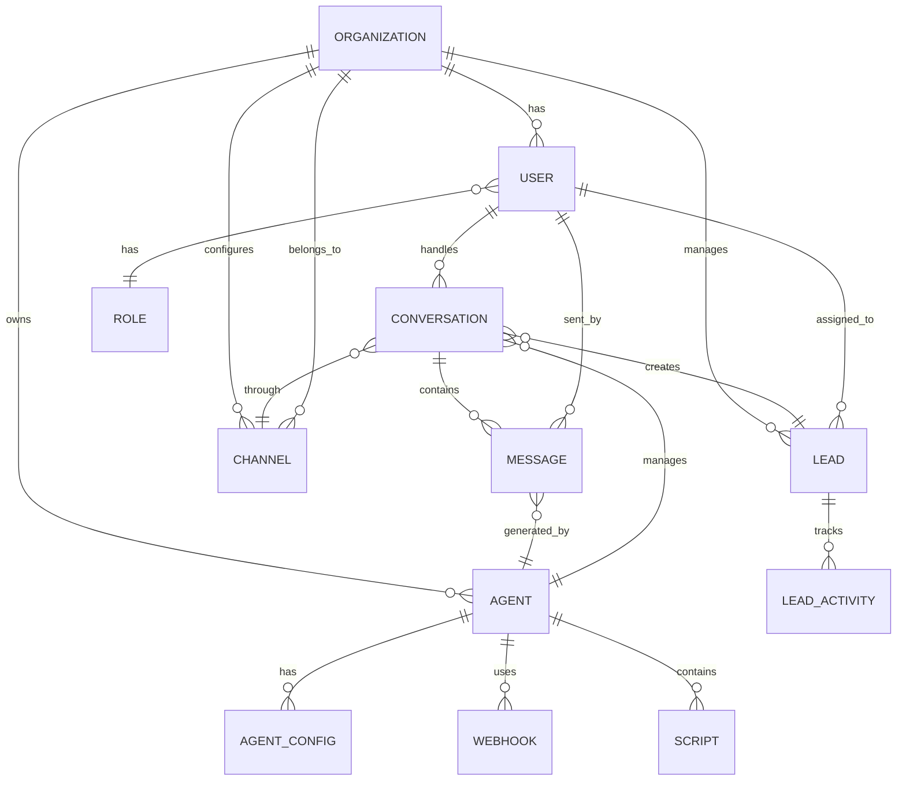

# SmarterChat - Modelagem do Banco de Dados

## 1. Diagrama Entidade-Relacionamento



## 2. Tabelas Principais

### 2.1 Organizations (Multi-tenancy)

```sql
CREATE TABLE organizations (
    id UUID PRIMARY KEY DEFAULT gen_random_uuid(),
    name VARCHAR(255) NOT NULL,
    slug VARCHAR(100) UNIQUE NOT NULL,
    plan VARCHAR(50) NOT NULL DEFAULT 'free', -- free, starter, professional, enterprise
    status VARCHAR(20) NOT NULL DEFAULT 'active', -- active, suspended, cancelled
    
    -- Configurações
    settings JSONB DEFAULT '{}',
    branding JSONB DEFAULT '{}', -- logo, cores, etc
    
    -- Limites do plano
    max_agents INTEGER DEFAULT 1,
    max_conversations_per_month INTEGER DEFAULT 100,
    max_users INTEGER DEFAULT 3,
    
    -- Timestamps
    created_at TIMESTAMP WITH TIME ZONE DEFAULT CURRENT_TIMESTAMP,
    updated_at TIMESTAMP WITH TIME ZONE DEFAULT CURRENT_TIMESTAMP,
    deleted_at TIMESTAMP WITH TIME ZONE
);

CREATE INDEX idx_organizations_slug ON organizations(slug);
CREATE INDEX idx_organizations_status ON organizations(status);
```

### 2.2 Users

```sql
CREATE TABLE users (
    id UUID PRIMARY KEY DEFAULT gen_random_uuid(),
    organization_id UUID NOT NULL REFERENCES organizations(id) ON DELETE CASCADE,
    
    -- Informações básicas
    email VARCHAR(255) UNIQUE NOT NULL,
    password_hash VARCHAR(255) NOT NULL,
    full_name VARCHAR(255) NOT NULL,
    avatar_url VARCHAR(500),
    
    -- Autenticação
    email_verified BOOLEAN DEFAULT FALSE,
    two_factor_enabled BOOLEAN DEFAULT FALSE,
    two_factor_secret VARCHAR(255),
    
    -- Role e permissões
    role VARCHAR(50) NOT NULL DEFAULT 'consultant', -- super_admin, admin, manager, consultant
    permissions JSONB DEFAULT '[]',
    
    -- Status
    status VARCHAR(20) NOT NULL DEFAULT 'active', -- active, inactive, suspended
    last_login_at TIMESTAMP WITH TIME ZONE,
    
    -- Preferências
    preferences JSONB DEFAULT '{}',
    
    -- Timestamps
    created_at TIMESTAMP WITH TIME ZONE DEFAULT CURRENT_TIMESTAMP,
    updated_at TIMESTAMP WITH TIME ZONE DEFAULT CURRENT_TIMESTAMP,
    deleted_at TIMESTAMP WITH TIME ZONE
);

CREATE INDEX idx_users_organization ON users(organization_id);
CREATE INDEX idx_users_email ON users(email);
CREATE INDEX idx_users_role ON users(role);
```

### 2.3 Agents

```sql
CREATE TABLE agents (
    id UUID PRIMARY KEY DEFAULT gen_random_uuid(),
    organization_id UUID NOT NULL REFERENCES organizations(id) ON DELETE CASCADE,
    
    -- Informações básicas
    name VARCHAR(255) NOT NULL,
    description TEXT,
    avatar_url VARCHAR(500),
    
    -- Configuração de IA
    personality TEXT NOT NULL, -- Descrição da personalidade
    tone VARCHAR(50) DEFAULT 'professional', -- professional, friendly, casual, formal
    objective TEXT NOT NULL, -- Objetivo principal do agente
    
    -- System Message e Scripts
    system_message TEXT NOT NULL,
    custom_scripts JSONB DEFAULT '[]', -- Array de scripts personalizados
    context_data JSONB DEFAULT '{}', -- Contexto adicional
    
    -- Configuração OpenAI
    openai_api_key_encrypted TEXT, -- Criptografado com AES-256
    model VARCHAR(50) DEFAULT 'gpt-4-turbo-preview',
    temperature DECIMAL(2,1) DEFAULT 0.7,
    max_tokens INTEGER DEFAULT 1000,
    
    -- Comportamento
    auto_response_enabled BOOLEAN DEFAULT TRUE,
    handoff_rules JSONB DEFAULT '{}', -- Regras para transferir para humano
    lead_qualification_rules JSONB DEFAULT '{}',
    
    -- Idiomas suportados
    languages JSONB DEFAULT '["pt-BR"]',
    default_language VARCHAR(10) DEFAULT 'pt-BR',
    
    -- Status
    status VARCHAR(20) NOT NULL DEFAULT 'active', -- active, inactive, training
    is_published BOOLEAN DEFAULT FALSE,
    
    -- Métricas
    total_conversations INTEGER DEFAULT 0,
    avg_response_time_ms INTEGER,
    satisfaction_score DECIMAL(3,2),
    
    -- Timestamps
    created_at TIMESTAMP WITH TIME ZONE DEFAULT CURRENT_TIMESTAMP,
    updated_at TIMESTAMP WITH TIME ZONE DEFAULT CURRENT_TIMESTAMP,
    deleted_at TIMESTAMP WITH TIME ZONE
);

CREATE INDEX idx_agents_organization ON agents(organization_id);
CREATE INDEX idx_agents_status ON agents(status);
```

### 2.4 Channels (WhatsApp, Instagram)

```sql
CREATE TABLE channels (
    id UUID PRIMARY KEY DEFAULT gen_random_uuid(),
    organization_id UUID NOT NULL REFERENCES organizations(id) ON DELETE CASCADE,
    agent_id UUID REFERENCES agents(id) ON DELETE SET NULL,
    
    -- Tipo de canal
    type VARCHAR(50) NOT NULL, -- whatsapp, instagram, telegram, webchat
    name VARCHAR(255) NOT NULL,
    
    -- Configurações específicas do canal
    config JSONB NOT NULL, -- Tokens, IDs, números, etc
    
    -- WhatsApp específico
    phone_number VARCHAR(20),
    phone_number_id VARCHAR(100),
    business_account_id VARCHAR(100),
    
    -- Instagram específico
    instagram_account_id VARCHAR(100),
    instagram_username VARCHAR(100),
    
    -- Webhook
    webhook_url VARCHAR(500),
    webhook_secret VARCHAR(255),
    
    -- Status
    status VARCHAR(20) NOT NULL DEFAULT 'inactive', -- active, inactive, error
    last_sync_at TIMESTAMP WITH TIME ZONE,
    error_message TEXT,
    
    -- Timestamps
    created_at TIMESTAMP WITH TIME ZONE DEFAULT CURRENT_TIMESTAMP,
    updated_at TIMESTAMP WITH TIME ZONE DEFAULT CURRENT_TIMESTAMP,
    deleted_at TIMESTAMP WITH TIME ZONE
);

CREATE INDEX idx_channels_organization ON channels(organization_id);
CREATE INDEX idx_channels_agent ON channels(agent_id);
CREATE INDEX idx_channels_type ON channels(type);
```

### 2.5 Conversations

```sql
CREATE TABLE conversations (
    id UUID PRIMARY KEY DEFAULT gen_random_uuid(),
    organization_id UUID NOT NULL REFERENCES organizations(id) ON DELETE CASCADE,
    agent_id UUID REFERENCES agents(id) ON DELETE SET NULL,
    channel_id UUID NOT NULL REFERENCES channels(id) ON DELETE CASCADE,
    lead_id UUID REFERENCES leads(id) ON DELETE SET NULL,
    
    -- Identificação do contato
    contact_identifier VARCHAR(255) NOT NULL, -- Número de telefone, Instagram ID, etc
    contact_name VARCHAR(255),
    contact_metadata JSONB DEFAULT '{}',
    
    -- Status da conversa
    status VARCHAR(50) NOT NULL DEFAULT 'active', -- active, waiting, closed, archived
    mode VARCHAR(50) NOT NULL DEFAULT 'ai', -- ai, human, hybrid
    
    -- Atendimento humano
    assigned_to_user_id UUID REFERENCES users(id) ON DELETE SET NULL,
    assigned_at TIMESTAMP WITH TIME ZONE,
    
    -- Contexto da conversa
    context JSONB DEFAULT '{}', -- Informações coletadas durante a conversa
    summary TEXT, -- Resumo gerado pela IA
    
    -- Classificação
    sentiment VARCHAR(20), -- positive, neutral, negative
    priority VARCHAR(20) DEFAULT 'normal', -- low, normal, high, urgent
    tags JSONB DEFAULT '[]',
    
    -- Métricas
    message_count INTEGER DEFAULT 0,
    ai_message_count INTEGER DEFAULT 0,
    human_message_count INTEGER DEFAULT 0,
    first_response_time_ms INTEGER,
    avg_response_time_ms INTEGER,
    
    -- Timestamps
    last_message_at TIMESTAMP WITH TIME ZONE,
    closed_at TIMESTAMP WITH TIME ZONE,
    created_at TIMESTAMP WITH TIME ZONE DEFAULT CURRENT_TIMESTAMP,
    updated_at TIMESTAMP WITH TIME ZONE DEFAULT CURRENT_TIMESTAMP
);

CREATE INDEX idx_conversations_organization ON conversations(organization_id);
CREATE INDEX idx_conversations_agent ON conversations(agent_id);
CREATE INDEX idx_conversations_channel ON conversations(channel_id);
CREATE INDEX idx_conversations_lead ON conversations(lead_id);
CREATE INDEX idx_conversations_assigned_to ON conversations(assigned_to_user_id);
CREATE INDEX idx_conversations_status ON conversations(status);
CREATE INDEX idx_conversations_mode ON conversations(mode);
CREATE INDEX idx_conversations_contact ON conversations(contact_identifier);
```

### 2.6 Messages

```sql
CREATE TABLE messages (
    id UUID PRIMARY KEY DEFAULT gen_random_uuid(),
    conversation_id UUID NOT NULL REFERENCES conversations(id) ON DELETE CASCADE,
    
    -- Origem da mensagem
    sender_type VARCHAR(20) NOT NULL, -- contact, ai, user
    sender_id UUID, -- ID do user se sender_type = user
    
    -- Conteúdo
    content TEXT NOT NULL,
    content_type VARCHAR(50) DEFAULT 'text', -- text, image, video, audio, document
    media_url VARCHAR(500),
    media_metadata JSONB,
    
    -- Metadados
    direction VARCHAR(20) NOT NULL, -- inbound, outbound
    status VARCHAR(50) DEFAULT 'sent', -- sent, delivered, read, failed
    
    -- IA específico
    ai_generated BOOLEAN DEFAULT FALSE,
    ai_model VARCHAR(50),
    ai_confidence DECIMAL(3,2),
    ai_processing_time_ms INTEGER,
    prompt_tokens INTEGER,
    completion_tokens INTEGER,
    
    -- Contexto
    intent VARCHAR(100), -- Intenção identificada pela IA
    entities JSONB DEFAULT '{}', -- Entidades extraídas
    
    -- Integração externa
    external_id VARCHAR(255), -- ID da mensagem no WhatsApp/Instagram
    external_metadata JSONB,
    
    -- Timestamps
    sent_at TIMESTAMP WITH TIME ZONE DEFAULT CURRENT_TIMESTAMP,
    delivered_at TIMESTAMP WITH TIME ZONE,
    read_at TIMESTAMP WITH TIME ZONE,
    created_at TIMESTAMP WITH TIME ZONE DEFAULT CURRENT_TIMESTAMP
);

CREATE INDEX idx_messages_conversation ON messages(conversation_id);
CREATE INDEX idx_messages_sender ON messages(sender_type, sender_id);
CREATE INDEX idx_messages_created_at ON messages(created_at DESC);
CREATE INDEX idx_messages_external_id ON messages(external_id);
```

### 2.7 Leads (CRM)

```sql
CREATE TABLE leads (
    id UUID PRIMARY KEY DEFAULT gen_random_uuid(),
    organization_id UUID NOT NULL REFERENCES organizations(id) ON DELETE CASCADE,
    
    -- Informações básicas
    name VARCHAR(255),
    email VARCHAR(255),
    phone VARCHAR(50),
    
    -- Classificação
    status VARCHAR(50) NOT NULL DEFAULT 'new', -- new, contacted, qualified, converted, lost
    temperature VARCHAR(20) DEFAULT 'cold', -- hot, warm, cold
    score INTEGER DEFAULT 0, -- 0-100
    
    -- Origem
    source VARCHAR(100), -- whatsapp, instagram, webchat
    channel_id UUID REFERENCES channels(id) ON DELETE SET NULL,
    
    -- Atribuição
    assigned_to_user_id UUID REFERENCES users(id) ON DELETE SET NULL,
    assigned_at TIMESTAMP WITH TIME ZONE,
    
    -- Informações adicionais
    company VARCHAR(255),
    position VARCHAR(255),
    interest TEXT,
    notes TEXT,
    
    -- Campos personalizados
    custom_fields JSONB DEFAULT '{}',
    
    -- Tags e segmentação
    tags JSONB DEFAULT '[]',
    segment VARCHAR(100),
    
    -- Métricas
    total_interactions INTEGER DEFAULT 0,
    last_interaction_at TIMESTAMP WITH TIME ZONE,
    conversion_probability DECIMAL(3,2),
    
    -- Timestamps
    converted_at TIMESTAMP WITH TIME ZONE,
    lost_at TIMESTAMP WITH TIME ZONE,
    created_at TIMESTAMP WITH TIME ZONE DEFAULT CURRENT_TIMESTAMP,
    updated_at TIMESTAMP WITH TIME ZONE DEFAULT CURRENT_TIMESTAMP,
    deleted_at TIMESTAMP WITH TIME ZONE
);

CREATE INDEX idx_leads_organization ON leads(organization_id);
CREATE INDEX idx_leads_status ON leads(status);
CREATE INDEX idx_leads_temperature ON leads(temperature);
CREATE INDEX idx_leads_assigned_to ON leads(assigned_to_user_id);
CREATE INDEX idx_leads_email ON leads(email);
CREATE INDEX idx_leads_phone ON leads(phone);
```

### 2.8 Lead Activities

```sql
CREATE TABLE lead_activities (
    id UUID PRIMARY KEY DEFAULT gen_random_uuid(),
    lead_id UUID NOT NULL REFERENCES leads(id) ON DELETE CASCADE,
    user_id UUID REFERENCES users(id) ON DELETE SET NULL,
    
    -- Tipo de atividade
    type VARCHAR(50) NOT NULL, -- note, call, email, meeting, status_change, assignment
    
    -- Conteúdo
    title VARCHAR(255),
    description TEXT,
    metadata JSONB DEFAULT '{}',
    
    -- Timestamps
    created_at TIMESTAMP WITH TIME ZONE DEFAULT CURRENT_TIMESTAMP
);

CREATE INDEX idx_lead_activities_lead ON lead_activities(lead_id);
CREATE INDEX idx_lead_activities_type ON lead_activities(type);
CREATE INDEX idx_lead_activities_created_at ON lead_activities(created_at DESC);
```

### 2.9 Webhooks

```sql
CREATE TABLE webhooks (
    id UUID PRIMARY KEY DEFAULT gen_random_uuid(),
    organization_id UUID NOT NULL REFERENCES organizations(id) ON DELETE CASCADE,
    agent_id UUID REFERENCES agents(id) ON DELETE CASCADE,
    
    -- Configuração
    name VARCHAR(255) NOT NULL,
    url VARCHAR(500) NOT NULL,
    method VARCHAR(10) DEFAULT 'POST',
    headers JSONB DEFAULT '{}',
    
    -- Eventos que disparam o webhook
    events JSONB NOT NULL, -- ['message.received', 'lead.created', etc]
    
    -- Segurança
    secret VARCHAR(255),
    
    -- Retry
    retry_enabled BOOLEAN DEFAULT TRUE,
    max_retries INTEGER DEFAULT 3,
    retry_delay_seconds INTEGER DEFAULT 60,
    
    -- Status
    status VARCHAR(20) NOT NULL DEFAULT 'active',
    last_triggered_at TIMESTAMP WITH TIME ZONE,
    
    -- Timestamps
    created_at TIMESTAMP WITH TIME ZONE DEFAULT CURRENT_TIMESTAMP,
    updated_at TIMESTAMP WITH TIME ZONE DEFAULT CURRENT_TIMESTAMP
);

CREATE INDEX idx_webhooks_organization ON webhooks(organization_id);
CREATE INDEX idx_webhooks_agent ON webhooks(agent_id);
```

### 2.10 Webhook Logs

```sql
CREATE TABLE webhook_logs (
    id UUID PRIMARY KEY DEFAULT gen_random_uuid(),
    webhook_id UUID NOT NULL REFERENCES webhooks(id) ON DELETE CASCADE,
    
    -- Request
    event_type VARCHAR(100) NOT NULL,
    payload JSONB NOT NULL,
    
    -- Response
    status_code INTEGER,
    response_body TEXT,
    error_message TEXT,
    
    -- Timing
    duration_ms INTEGER,
    
    -- Retry
    attempt_number INTEGER DEFAULT 1,
    
    -- Timestamp
    created_at TIMESTAMP WITH TIME ZONE DEFAULT CURRENT_TIMESTAMP
);

CREATE INDEX idx_webhook_logs_webhook ON webhook_logs(webhook_id);
CREATE INDEX idx_webhook_logs_created_at ON webhook_logs(created_at DESC);
```

### 2.11 Scripts (Personalizações)

```sql
CREATE TABLE scripts (
    id UUID PRIMARY KEY DEFAULT gen_random_uuid(),
    agent_id UUID NOT NULL REFERENCES agents(id) ON DELETE CASCADE,
    
    -- Informações
    name VARCHAR(255) NOT NULL,
    description TEXT,
    
    -- Script
    content TEXT NOT NULL,
    type VARCHAR(50) NOT NULL, -- prompt_modifier, response_filter, intent_handler
    
    -- Ordem de execução
    priority INTEGER DEFAULT 0,
    
    -- Status
    enabled BOOLEAN DEFAULT TRUE,
    
    -- Timestamps
    created_at TIMESTAMP WITH TIME ZONE DEFAULT CURRENT_TIMESTAMP,
    updated_at TIMESTAMP WITH TIME ZONE DEFAULT CURRENT_TIMESTAMP
);

CREATE INDEX idx_scripts_agent ON scripts(agent_id);
CREATE INDEX idx_scripts_enabled ON scripts(enabled);
```

### 2.12 Analytics Events

```sql
CREATE TABLE analytics_events (
    id UUID PRIMARY KEY DEFAULT gen_random_uuid(),
    organization_id UUID NOT NULL REFERENCES organizations(id) ON DELETE CASCADE,
    
    -- Evento
    event_type VARCHAR(100) NOT NULL,
    event_data JSONB NOT NULL,
    
    -- Contexto
    agent_id UUID REFERENCES agents(id) ON DELETE SET NULL,
    user_id UUID REFERENCES users(id) ON DELETE SET NULL,
    conversation_id UUID REFERENCES conversations(id) ON DELETE SET NULL,
    lead_id UUID REFERENCES leads(id) ON DELETE SET NULL,
    
    -- Timestamp
    created_at TIMESTAMP WITH TIME ZONE DEFAULT CURRENT_TIMESTAMP
);

CREATE INDEX idx_analytics_organization ON analytics_events(organization_id);
CREATE INDEX idx_analytics_event_type ON analytics_events(event_type);
CREATE INDEX idx_analytics_created_at ON analytics_events(created_at DESC);
```

## 3. Views Úteis

### 3.1 Conversation Summary View

```sql
CREATE VIEW conversation_summary AS
SELECT 
    c.id,
    c.organization_id,
    c.agent_id,
    c.status,
    c.mode,
    c.contact_name,
    c.contact_identifier,
    l.name as lead_name,
    l.temperature as lead_temperature,
    u.full_name as assigned_to_name,
    c.message_count,
    c.last_message_at,
    c.created_at,
    (SELECT content FROM messages WHERE conversation_id = c.id ORDER BY created_at DESC LIMIT 1) as last_message
FROM conversations c
LEFT JOIN leads l ON c.lead_id = l.id
LEFT JOIN users u ON c.assigned_to_user_id = u.id;
```

### 3.2 Agent Performance View

```sql
CREATE VIEW agent_performance AS
SELECT 
    a.id,
    a.name,
    a.organization_id,
    COUNT(DISTINCT c.id) as total_conversations,
    COUNT(DISTINCT CASE WHEN c.status = 'active' THEN c.id END) as active_conversations,
    COUNT(DISTINCT l.id) as total_leads,
    COUNT(DISTINCT CASE WHEN l.temperature = 'hot' THEN l.id END) as hot_leads,
    AVG(c.avg_response_time_ms) as avg_response_time,
    AVG(CASE WHEN c.sentiment = 'positive' THEN 1 WHEN c.sentiment = 'negative' THEN -1 ELSE 0 END) as sentiment_score
FROM agents a
LEFT JOIN conversations c ON a.id = c.agent_id
LEFT JOIN leads l ON c.lead_id = l.id
GROUP BY a.id, a.name, a.organization_id;
```

## 4. Índices Adicionais para Performance

```sql
-- Índices compostos para queries comuns
CREATE INDEX idx_conversations_org_status ON conversations(organization_id, status);
CREATE INDEX idx_conversations_org_assigned ON conversations(organization_id, assigned_to_user_id);
CREATE INDEX idx_messages_conv_created ON messages(conversation_id, created_at DESC);
CREATE INDEX idx_leads_org_status ON leads(organization_id, status);
CREATE INDEX idx_leads_org_temp ON leads(organization_id, temperature);

-- Índices para busca full-text
CREATE INDEX idx_messages_content_fts ON messages USING gin(to_tsvector('portuguese', content));
CREATE INDEX idx_leads_name_fts ON leads USING gin(to_tsvector('portuguese', name));
```

## 5. Triggers

### 5.1 Update Timestamps

```sql
CREATE OR REPLACE FUNCTION update_updated_at_column()
RETURNS TRIGGER AS $$
BEGIN
    NEW.updated_at = CURRENT_TIMESTAMP;
    RETURN NEW;
END;
$$ language 'plpgsql';

-- Aplicar em todas as tabelas com updated_at
CREATE TRIGGER update_organizations_updated_at BEFORE UPDATE ON organizations FOR EACH ROW EXECUTE FUNCTION update_updated_at_column();
CREATE TRIGGER update_users_updated_at BEFORE UPDATE ON users FOR EACH ROW EXECUTE FUNCTION update_updated_at_column();
CREATE TRIGGER update_agents_updated_at BEFORE UPDATE ON agents FOR EACH ROW EXECUTE FUNCTION update_updated_at_column();
-- ... (aplicar em todas as tabelas relevantes)
```

### 5.2 Update Conversation Stats

```sql
CREATE OR REPLACE FUNCTION update_conversation_stats()
RETURNS TRIGGER AS $$
BEGIN
    UPDATE conversations
    SET 
        message_count = message_count + 1,
        last_message_at = NEW.created_at,
        ai_message_count = CASE WHEN NEW.sender_type = 'ai' THEN ai_message_count + 1 ELSE ai_message_count END,
        human_message_count = CASE WHEN NEW.sender_type = 'user' THEN human_message_count + 1 ELSE human_message_count END
    WHERE id = NEW.conversation_id;
    
    RETURN NEW;
END;
$$ language 'plpgsql';

CREATE TRIGGER update_conversation_stats_trigger 
AFTER INSERT ON messages 
FOR EACH ROW 
EXECUTE FUNCTION update_conversation_stats();
```

## 6. Particionamento (Para Escala)

Para organizações com alto volume, particionar tabelas de mensagens e eventos:

```sql
-- Particionar messages por mês
CREATE TABLE messages_partitioned (
    LIKE messages INCLUDING ALL
) PARTITION BY RANGE (created_at);

-- Criar partições mensais
CREATE TABLE messages_2025_01 PARTITION OF messages_partitioned
    FOR VALUES FROM ('2025-01-01') TO ('2025-02-01');
    
CREATE TABLE messages_2025_02 PARTITION OF messages_partitioned
    FOR VALUES FROM ('2025-02-01') TO ('2025-03-01');
-- ... continuar
```

## 7. Políticas de Retenção

```sql
-- Deletar mensagens antigas (após 1 ano)
DELETE FROM messages WHERE created_at < NOW() - INTERVAL '1 year';

-- Arquivar conversas inativas (após 90 dias)
UPDATE conversations 
SET status = 'archived' 
WHERE status = 'closed' 
AND closed_at < NOW() - INTERVAL '90 days';
```
