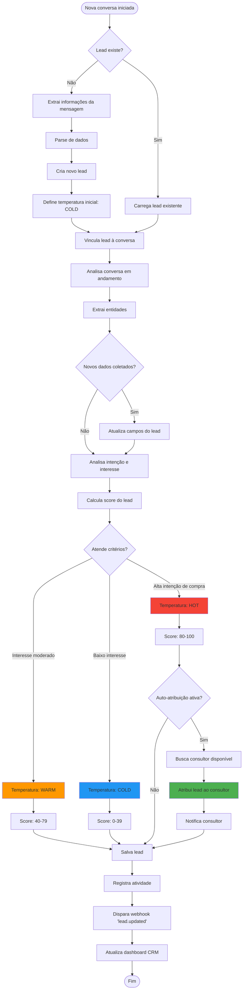
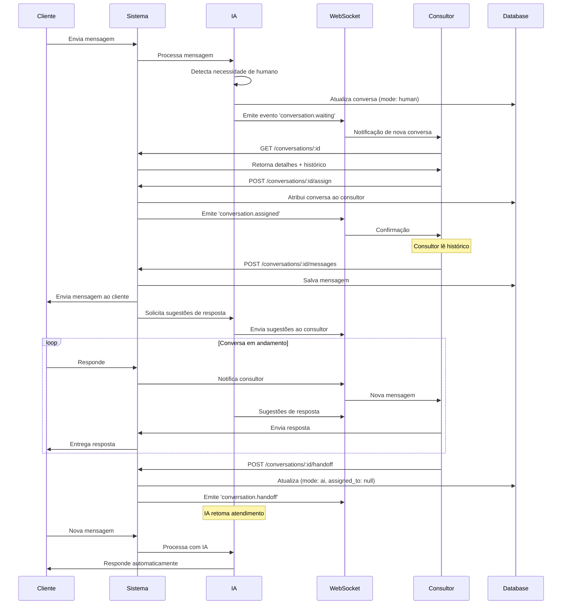
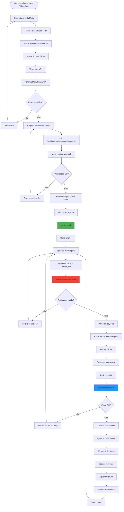
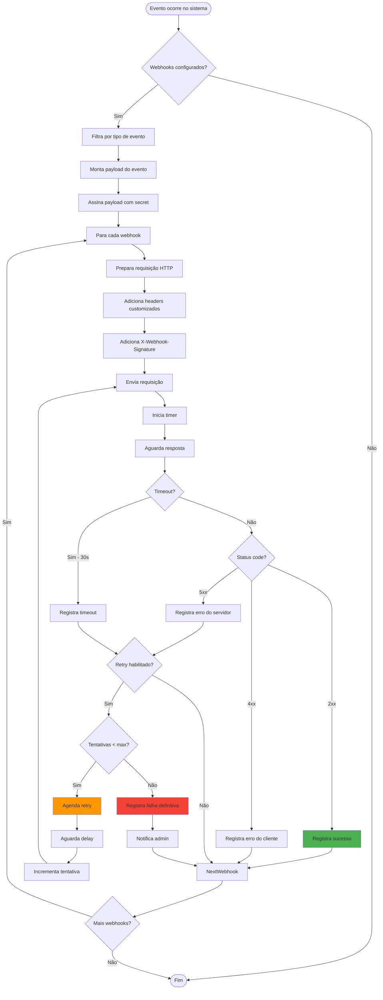
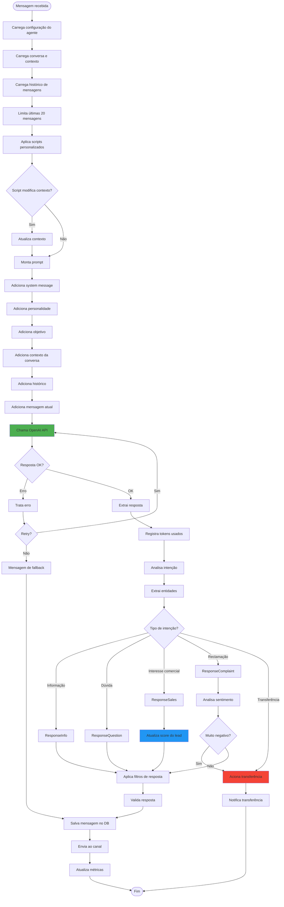
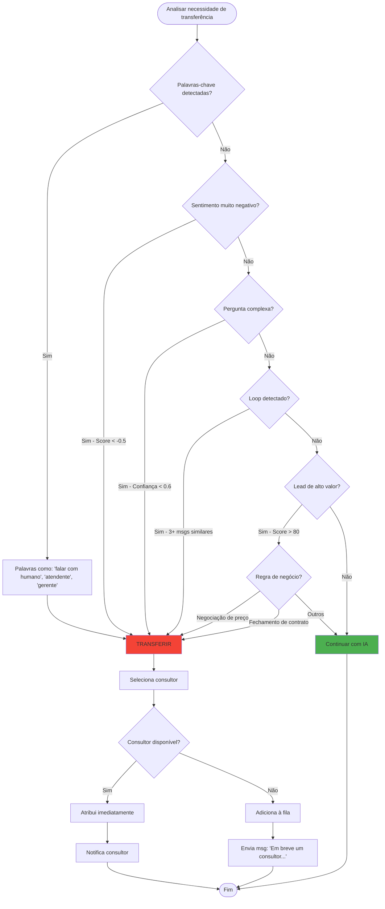

# SmarterChat - Fluxos de Atendimento

## 1. Fluxo Principal de Atendimento Híbrido (IA + Humano)

```mermaid
flowchart TD
    Start([Cliente envia mensagem]) --> CheckChannel{Canal configurado?}
    
    CheckChannel -->|Não| Error[Retorna erro]
    CheckChannel -->|Sim| ReceiveMsg[Webhook recebe mensagem]
    
    ReceiveMsg --> Queue[Adiciona à fila de processamento]
    Queue --> CheckConv{Conversa existe?}
    
    CheckConv -->|Não| CreateConv[Cria nova conversa]
    CheckConv -->|Sim| LoadConv[Carrega conversa existente]
    
    CreateConv --> CreateLead[Cria lead automático]
    CreateLead --> LoadAgent
    LoadConv --> LoadAgent[Carrega configuração do agente]
    
    LoadAgent --> CheckMode{Modo da conversa?}
    
    CheckMode -->|AI| ProcessAI[Processa com IA]
    CheckMode -->|Human| NotifyHuman[Notifica consultor]
    CheckMode -->|Hybrid| CheckContext{Contexto requer humano?}
    
    CheckContext -->|Sim| NotifyHuman
    CheckContext -->|Não| ProcessAI
    
    ProcessAI --> LoadContext[Carrega contexto e histórico]
    LoadContext --> ApplyScripts[Aplica scripts personalizados]
    ApplyScripts --> BuildPrompt[Monta prompt com system message]
    BuildPrompt --> CallOpenAI[Chama OpenAI API]
    
    CallOpenAI --> AnalyzeResponse[Analisa resposta]
    AnalyzeResponse --> ExtractIntent[Extrai intenção e entidades]
    ExtractIntent --> UpdateContext[Atualiza contexto da conversa]
    
    UpdateContext --> CheckHandoff{Necessita transferência?}
    
    CheckHandoff -->|Sim - Palavras-chave| TransferHuman[Transfere para humano]
    CheckHandoff -->|Sim - Sentimento negativo| TransferHuman
    CheckHandoff -->|Sim - Complexidade alta| TransferHuman
    CheckHandoff -->|Não| UpdateLead[Atualiza lead com informações]
    
    UpdateLead --> ClassifyLead[Classifica temperatura do lead]
    ClassifyLead --> SendResponse[Envia resposta ao cliente]
    
    SendResponse --> TriggerWebhooks[Dispara webhooks configurados]
    TriggerWebhooks --> NotifyDashboard[Notifica dashboard via WebSocket]
    NotifyDashboard --> End([Fim])
    
    TransferHuman --> ChangeMode[Muda modo para 'human']
    ChangeMode --> NotifyConsultant[Notifica consultor disponível]
    NotifyConsultant --> WaitHuman[Aguarda resposta do consultor]
    
    WaitHuman --> HumanResponds[Consultor responde]
    HumanResponds --> SendHumanMsg[Envia mensagem do consultor]
    SendHumanMsg --> SuggestResponse[IA sugere próximas respostas]
    SuggestResponse --> NotifyDashboard
    
    NotifyHuman --> QueueHuman[Adiciona à fila de atendimento]
    QueueHuman --> End
    
    Error --> End
    
    style ProcessAI fill:#4CAF50
    style NotifyHuman fill:#FF9800
    style TransferHuman fill:#F44336
    style SendResponse fill:#2196F3
```

## 2. Fluxo de Criação e Qualificação de Lead

## 3. Fluxo de Consultor Assumindo Conversa

## 4. Fluxo de Configuração de Agente

```mermaid
flowchart TD
    Start([Admin acessa configuração]) --> LoadForm[Carrega formulário de agente]
    
    LoadForm --> FillBasic[Preenche informações básicas]
    FillBasic --> FillPersonality[Define personalidade e tom]
    FillPersonality --> WriteSystem[Escreve system message]
    
    WriteSystem --> AddScripts{Adicionar scripts?}
    AddScripts -->|Sim| WriteScripts[Escreve scripts personalizados]
    AddScripts -->|Não| ConfigAI
    
    WriteScripts --> TestScripts[Testa scripts]
    TestScripts --> ConfigAI[Configura API Key OpenAI]
    
    ConfigAI --> SelectModel[Seleciona modelo GPT]
    SelectModel --> SetParams[Define temperatura e max_tokens]
    
    SetParams --> ConfigHandoff[Configura regras de transferência]
    ConfigHandoff --> DefineKeywords[Define palavras-chave]
    DefineKeywords --> SetSentiment[Define threshold de sentimento]
    
    SetSentiment --> ConfigLead[Configura qualificação de leads]
    ConfigLead --> DefineRules[Define regras de classificação]
    
    DefineRules --> AddWebhooks{Adicionar webhooks?}
    AddWebhooks -->|Sim| ConfigWebhook[Configura URL e eventos]
    AddWebhooks -->|Não| Preview
    
    ConfigWebhook --> TestWebhook[Testa webhook]
    TestWebhook --> Preview[Preview do agente]
    
    Preview --> TestChat[Testa chat com IA]
    TestChat --> Satisfied{Satisfeito?}
    
    Satisfied -->|Não| AdjustConfig[Ajusta configurações]
    AdjustConfig --> Preview
    
    Satisfied -->|Sim| SaveAgent[Salva agente]
    SaveAgent --> EncryptKey[Criptografa API Key]
    EncryptKey --> PublishAgent{Publicar agente?}
    
    PublishAgent -->|Sim| SetPublished[is_published = true]
    PublishAgent -->|Não| SaveDraft[Salva como rascunho]
    
    SetPublished --> LinkChannels[Vincula canais]
    SaveDraft --> End([Fim])
    
    LinkChannels --> ActivateAgent[Ativa agente]
    ActivateAgent --> End
    
    style TestChat fill:#4CAF50
    style EncryptKey fill:#F44336
    style ActivateAgent fill:#2196F3
```

## 5. Fluxo de Integração com WhatsApp

## 6. Fluxo de Webhook Customizado

## 7. Fluxo de Processamento de IA

## 8. Decisões de Transferência para Humano

## 9. Resumo dos Principais Gatilhos

### Gatilhos de Transferência para Humano:
1. **Palavras-chave**: "falar com humano", "atendente", "gerente", "supervisor"
2. **Sentimento negativo**: Score < -0.5
3. **Baixa confiança da IA**: < 60%
4. **Loop de conversa**: 3+ mensagens similares sem progresso
5. **Lead de alto valor**: Score > 80 + negociação comercial
6. **Tópicos sensíveis**: Reclamações, cancelamentos, problemas técnicos

### Gatilhos de Criação de Lead:
1. **Nova conversa** iniciada
2. **Informações coletadas**: Nome, email, telefone
3. **Interesse demonstrado**: Perguntas sobre produtos/serviços

### Gatilhos de Atualização de Score:
1. **Perguntas sobre preços**: +10 pontos
2. **Interesse em demonstração**: +15 pontos
3. **Urgência expressa**: +20 pontos
4. **Orçamento mencionado**: +15 pontos
5. **Autoridade de decisão**: +10 pontos
6. **Mensagens negativas**: -10 pontos
7. **Demora em responder**: -5 pontos

### Gatilhos de Webhooks:
1. `conversation.new`: Nova conversa criada
2. `message.received`: Mensagem recebida
3. `message.sent`: Mensagem enviada
4. `lead.created`: Novo lead criado
5. `lead.qualified`: Lead qualificado (score > 60)
6. `lead.hot`: Lead quente (score > 80)
7. `conversation.assigned`: Conversa atribuída a consultor
8. `conversation.closed`: Conversa encerrada
